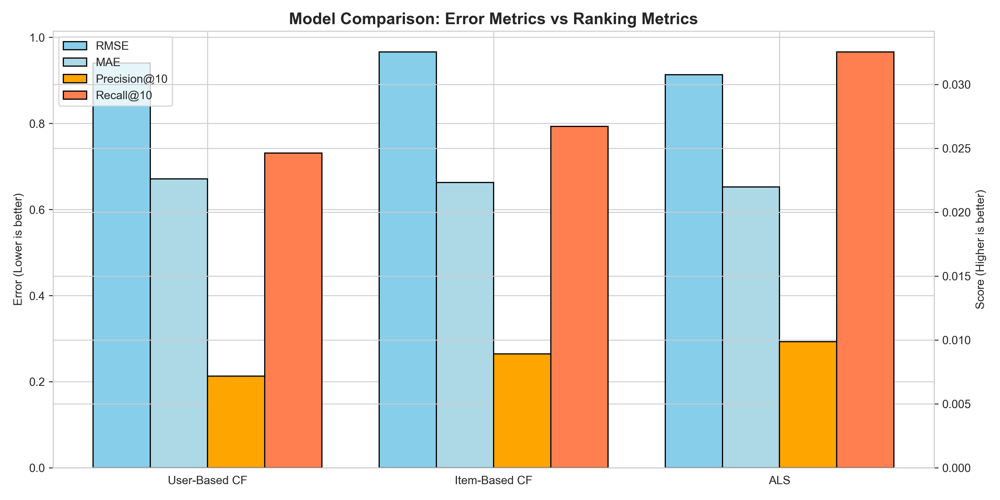

<script src="https://polyfill.io/v3/polyfill.min.js?features=es6"></script>
<script src="https://cdn.jsdelivr.net/npm/mathjax@3/es5/tex-mml-chtml.js"></script>

# Amazon Beauty Recommendation System (NumPy Implementation)


## 📑 Mục lục
- [1. Giới thiệu](#1-giới-thiệu)
- [2. Dataset](#2-dataset)
- [3. Phương pháp (Methodology)](#3-phương-pháp-methodology)
    - [Quy trình xử lý](#quy-trình-xử-lý)
    - [Thuật toán & Toán học](#thuật-toán--toán-học)
    - [Kỹ thuật NumPy](#kỹ-thuật-numpy-đã-sử-dụng)
- [4. Cài đặt & Thiết lập](#4-cài-đặt--thiết-lập)
- [5. Hướng dẫn sử dụng](#5-hướng-dẫn-sử-dụng)
- [6. Kết quả (Results)](#6-kết-quả-results)
- [7. Cấu trúc dự án](#7-cấu-trúc-dự-án)
- [8. Thách thức & Giải pháp](#8-thách-thức--giải-pháp)
- [9. Hướng phát triển](#9-hướng-phát-triển)
- [10. Tác giả](#10-tác-giả)
- [11. Giấy phép](#11-giấy-phép)
---

## 1. Giới thiệu

Dự án này tập trung xây dựng một **Hệ thống gợi ý sản phẩm (Recommendation System)** cho ngành hàng Làm đẹp (Beauty) trên Amazon. Mục tiêu chính không chỉ là xây dựng mô hình dự đoán, mà là **ứng dụng sâu thư viện NumPy** để cài đặt các thuật toán Học máy từ đầu (from scratch) mà không phụ thuộc vào các thư viện cao cấp như Scikit-learn hay TensorFlow.

Dự án giải quyết bài toán: *"Dựa trên lịch sử đánh giá của người dùng, hãy gợi ý những sản phẩm mỹ phẩm họ có khả năng thích nhất."*

---

## 2. Dataset

- **Nguồn dữ liệu:** Amazon - Ratings (Beauty Products).
- **Đặc điểm:**
    - **User ID:** Mã định danh người dùng.
    - **Product ID:** Mã định danh sản phẩm (ASIN).
    - **Rating:** Điểm đánh giá (1-5 sao).
    - **Timestamp:** Thời gian đánh giá.
- **Thống kê sơ bộ:**
    - Tổng số ratings: ~2,023,070.
    - Số lượng Users: ~1.2M.
    - Số lượng Products: ~249K.
    - **Độ thưa (Sparsity):** 99.99% (Đây là thách thức lớn nhất của bài toán).

---

## 3. Phương pháp (Methodology)

### Quy trình xử lý
1.  **Data Cleaning:** Loại bỏ các rating không hợp lệ, xử lý trùng lặp.
2.  **Filtering (k-core):** Chỉ giữ lại các User và Product có số lượng tương tác đạt ngưỡng nhất định (ví dụ: >15 ratings) để giảm độ thưa và giải quyết vấn đề Cold-start.
3.  **Data Splitting:** Chia tập dữ liệu thành Train/Validation/Test theo tỷ lệ (70/15/15).
4.  **Matrix Construction:** Chuyển đổi dữ liệu log sang ma trận thưa (Sparse Matrix CSR) để tối ưu bộ nhớ.

### Thuật toán & Toán học
Dự án cài đặt 3 thuật toán chính hoàn toàn bằng NumPy/SciPy:

#### a. User-Based Collaborative Filtering
Dự đoán rating dựa trên độ tương đồng giữa các người dùng.
- **Công thức Similarity (Cosine):**
  $$sim(u, v) = \frac{r_u \cdot r_v}{||r_u|| \cdot ||r_v||}$$
- **Dự đoán:**
  $$\hat{r}_{ui} = \bar{r}_u + \frac{\sum_{v \in N_i(u)} sim(u, v) (r_{vi} - \bar{r}_v)}{\sum_{v \in N_i(u)} |sim(u, v)|}$$

#### b. Item-Based Collaborative Filtering
Tương tự User-based nhưng tính toán độ tương đồng giữa các sản phẩm. Thường ổn định hơn User-based khi lượng người dùng lớn hơn lượng sản phẩm.

#### c. Matrix Factorization (ALS - Alternating Least Squares)
Phân rã ma trận Rating $R$ thành hai ma trận tiềm ẩn $P$ (User features) và $Q$ (Item features) sao cho $R \approx P \times Q^T$.
- **Hàm mất mát (Loss Function):**
  $$L = \sum_{(u,i) \in \mathcal{K}} (r_{ui} - p_u q_i^T)^2 + \lambda (||p_u||^2 + ||q_i||^2)$$
- **Tối ưu hóa:** Cố định $P$ để giải $Q$ và ngược lại lặp đi lặp lại cho đến khi hội tụ. Giải phương trình đạo hàm bằng không bằng NumPy Linear Algebra (`np.linalg.solve`).

### Kỹ thuật NumPy đã sử dụng
- **Vectorization:** Loại bỏ hoàn toàn vòng lặp Python khi tính toán Similarity và Prediction.
- **Broadcasting:** Sử dụng để trừ mean (center data) và nhân trọng số nhanh chóng.
- **Sparse Matrices (SciPy):** Sử dụng `csr_matrix` để lưu trữ dữ liệu rating nhằm tiết kiệm RAM (do ma trận rất thưa).
- **Fancy Indexing:** Truy xuất dữ liệu train/test nhanh chóng.

---

## 4. Cài đặt & Thiết lập

Yêu cầu môi trường: Python 3.8+

1.  **Clone repository:**
    ```bash
    git clone https://github.com/chomnhim/AMAZON_Project.git
    cd AMAZON_Project
    ```

2.  **Cài đặt thư viện:**
    ```bash
    pip install -r requirements.txt
    ```
    *(Thư viện chính: numpy, scipy, matplotlib, seaborn)*

3.  **Chuẩn bị dữ liệu:**
    - Tải file `ratings_Beauty.csv` và đặt vào thư mục `data/raw/`.

---

## 5. Hướng dẫn sử dụng

Chạy các notebook theo thứ tự sau để tái hiện kết quả:

1.  **`notebooks/01_data_exploration.ipynb`**: Khám phá dữ liệu, vẽ biểu đồ phân phối Rating, User activity, Product popularity.
2.  **`notebooks/02_preprocessing.ipynb`**: Làm sạch dữ liệu, lọc nhiễu, tạo ma trận thưa và chia tập dữ liệu.
3.  **`notebooks/03_modeling.ipynb`**: Huấn luyện các mô hình (UserCF, ItemCF, ALS), đánh giá và so sánh kết quả.

---

## 6. Kết quả (Results)

Đánh giá mô hình trên tập Validation/Test sử dụng các độ đo: RMSE, MAE và F1-Score@10.

### 📊 Bảng so sánh hiệu năng

| Metric | User-Based CF | Item-Based CF | ALS (Matrix Factorization) | Tốt nhất |
|:---|:---:|:---:|:---:|:---:|
| **RMSE** (Sai số bình phương trung bình) | 0.9400 | 0.9661 | **0.9129** | **ALS** |
| **MAE** (Sai số tuyệt đối trung bình) | 0.6710 | 0.6624 | **0.6521** | **ALS** |
| **F1-Score@10** (Độ đo xếp hạng) | 0.0111 | 0.0134 | **0.0151** | **ALS** |



### 💡 Phân tích & Nhận xét

**1. Hiệu năng tổng thể:**
- **Mô hình ALS (Matrix Factorization) vượt trội hoàn toàn:** ALS đạt kết quả tốt nhất trên cả hai phương diện: dự đoán điểm số chính xác nhất (RMSE thấp nhất) và khả năng gợi ý đúng sản phẩm cao nhất (F1@10 cao nhất).
- **Item-Based vs User-Based:** Item-Based có RMSE cao hơn (dự đoán điểm số lệch nhiều hơn) nhưng lại có F1-Score cao hơn User-Based. Điều này cho thấy Item-Based tuy dự đoán điểm số cụ thể không chính xác bằng, nhưng lại xếp hạng (ranking) các sản phẩm "đáng mua" tốt hơn User-Based.

**2. Tại sao ALS hoạt động tốt nhất?**
- **Xử lý Ma trận thưa (Sparsity):** Dữ liệu Amazon Beauty có độ thưa lên tới **99.99%**. Các thuật toán dựa trên láng giềng (Memory-based như User/Item CF) gặp khó khăn lớn khi tìm kiếm người dùng/sản phẩm tương đồng vì có quá ít điểm dữ liệu chung. Ngược lại, ALS (Model-based) hoạt động bằng cách phân rã ma trận để học các **đặc trưng tiềm ẩn (latent features)**, giúp "lấp đầy" các khoảng trống trong ma trận hiệu quả hơn.
- **Khả năng tổng quát hóa:** User-Based CF thường bị nhiễu bởi những người dùng có hành vi đánh giá thất thường. ALS giảm thiểu điều này thông qua tham số điều chuẩn (regularization - $\lambda$), giúp mô hình ít bị overfitting hơn.

**3. Phân tích các chỉ số:**
- **RMSE ~ 0.91:** Nghĩa là trung bình mô hình dự đoán lệch khoảng **0.9 sao** so với thực tế. Với thang điểm 1-5, đây là mức chấp nhận được đối với các hệ thống gợi ý sử dụng dữ liệu thực tế nhiều nhiễu.
- **Precision/Recall thấp (khoảng 1-3%):** Đây là hiện tượng bình thường trong bài toán gợi ý với không gian sản phẩm lớn (hàng trăm nghìn sản phẩm). Tuy nhiên, mức F1@10 của ALS cao hơn **36%** so với User-Based (0.0151 vs 0.0111) là một sự cải thiện đáng kể.

**4. Tác động của đặc điểm dữ liệu:**
- **Phân phối Long-tail:** Dữ liệu cho thấy một số ít sản phẩm phổ biến chiếm phần lớn lượt đánh giá.
    - **Item-Based CF** thường có xu hướng gợi ý các sản phẩm phổ biến (Popularity bias), do đó nó đạt điểm Ranking (F1) tốt hơn User-Based.
    - **User-Based CF** bị ảnh hưởng nặng nề bởi các người dùng ít tương tác (Cold-start users), dẫn đến độ chính xác thấp nhất.

**Kết luận:** Việc cài đặt thuật toán **Matrix Factorization (ALS)** sử dụng thuần **NumPy** đã chứng minh được hiệu quả vượt trội so với các phương pháp truyền thống trên bộ dữ liệu thưa như Amazon Beauty. Đây là lựa chọn tối ưu để triển khai hệ thống gợi ý trong thực tế cho bài toán này.

---

## 7. Cấu trúc dự án

```text
[cite_start]Cấu trúc thư mục tuân theo yêu cầu đề bài [cite: 56-72]:
project-name/
├── README.md
├── requirements.txt
├── data/		
│   ├── raw/           	# Dữ liệu gốc
│   └── processed/      # Dữ liệu đã xử lý
├── notebooks/
│   ├── 01_data_exploration.ipynb
│   ├── 02_preprocessing.ipynb
│   └── 03_modeling.ipynb
├── src/
│   ├── __init__.py
│   ├── data_processing.py
│   ├── visualization.py
│   └── models.py
```
---

## 8. Thách thức & Giải pháp

1.  **Vấn đề bộ nhớ (Memory Error):**
    - *Thách thức:* Ma trận tương đồng (User-User) kích thước ~1M x 1M quá lớn để lưu trong RAM.
    - *Giải pháp:* Sử dụng `scipy.sparse` để lưu trữ. Tính toán theo từng batch (chunking) khi tìm K-láng giềng gần nhất thay vì tính toàn bộ ma trận cùng lúc.

2.  **Hiệu năng tính toán:**
    - *Thách thức:* Vòng lặp Python quá chậm khi duyệt qua hàng triệu ratings.
    - *Giải pháp:* Vector hóa toàn bộ các phép tính cộng, trừ, nhân ma trận bằng NumPy Broadcasting và Dot product.

3.  **Dữ liệu thưa (Sparsity):**
    - *Thách thức:* 99.99% dữ liệu là rỗng, các thuật toán CF khó tìm được láng giềng.
    - *Giải pháp:* Áp dụng kỹ thuật lọc (iterative filtering) để giữ lại core-users và core-items, đảm bảo mật độ dữ liệu đủ để mô hình học.

---

## 9. Hướng phát triển

- **Tối ưu Hyperparameters:** Sử dụng Grid Search để tìm tham số tối ưu cho `k` (số láng giềng/số factors) và `lambda` (regularization).
- **Hybrid Model:** Kết hợp Content-based (dựa trên mô tả sản phẩm) với Collaborative Filtering để giải quyết vấn đề Cold-start tốt hơn.
- **Triển khai:** Xây dựng API đơn giản với Flask/FastAPI để phục vụ gợi ý thời gian thực.

---

## 10. Tác giả

**Họ và tên:** [Nguyễn XUân Quang]

**MSSV:** [23122047]

**Lớp:** 23TNT1

---
**Liên hệ:** Nếu có thắc mắc, vui lòng liên hệ qua email [23122047@student.hcmus.edu.vn].

---

## 11. Giấy phép (License)

Dự án này được phân phối dưới giấy phép **MIT License**. Xem chi tiết tại file [LICENSE](./LICENSE).